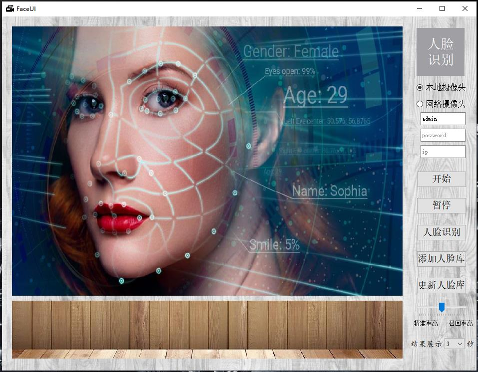
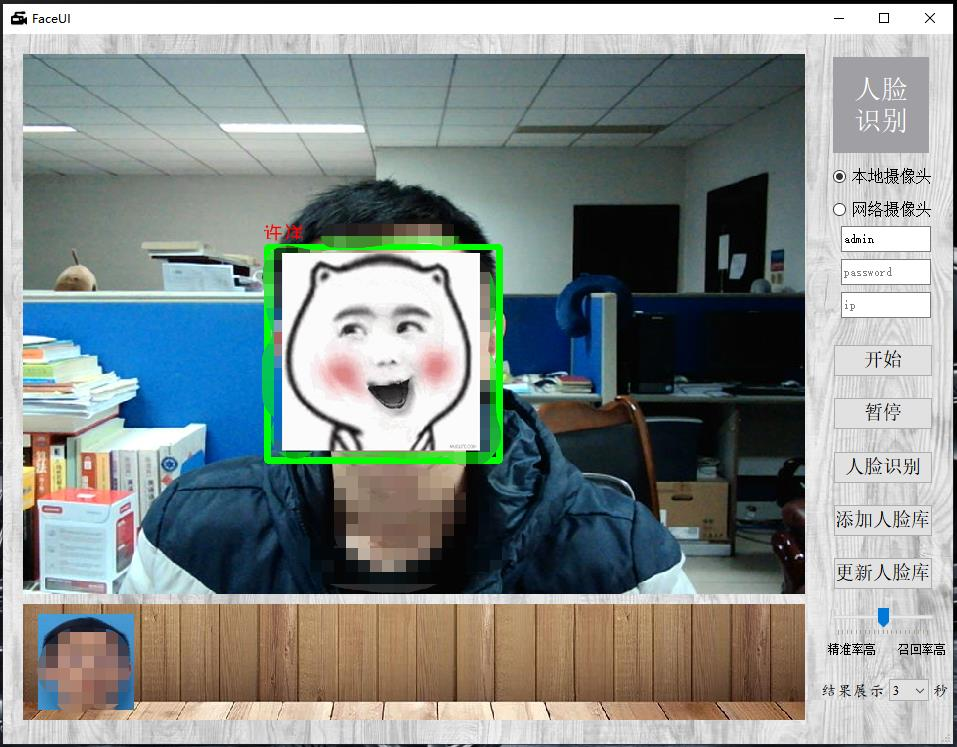

# real_time_face_recognition_with_GUI

Except all files in this directory, please download additional files needed for the project before running. 

> File address: http://https://pan.baidu.com/s/1JlsiMbZdg6uRY9Q2qRzsAw     Extraction code: *qdvr*

> Or you can download from https://download.csdn.net/download/Breathing_yang/12043726

Then unzip the downloaded "models.zip" and replace it with the "models" folder in the project (the "models" folder in the project was originally an empty folder).

Run "FaceCompleteUI.py".

#### Example:

Main GUI:

Real-time face detection and recognition :

Some pictures and files are referenced on the Internet.

> [1] https://github.com/davidsandberg/facenet

> [2] https://github.com/shanren7/real_time_face_recognition
